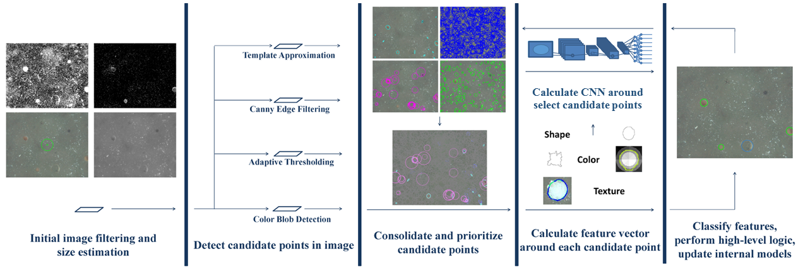
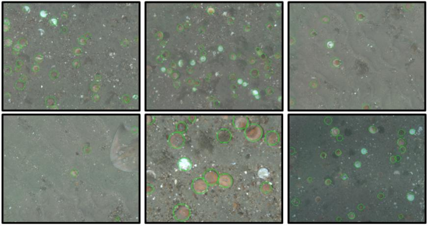

Scallop-TK
==========

The Scalable, Adaptive Localization, and Laplacian Object Proposal
(Scallop) Toolkit is a small computer vision toolkit aimed at
detecting roughly elliptical or blob-like objects in imagery. It
is brief port of some of my master's thesis code developed at RPI,
described further in the paper:

[Automatic Scallop Detection in Benthic Environments](Documentation/Paper.pdf)

Beyond what's in the paper, the toolkit has a few more modern optimizations
as well, such as the ability to run convolutional neural networks on top of the
described object proposal framework. It is useful as a general detector
for detecting any ellipsoidal objects, though it also contains specialized
subroutines targetting benthic organisms such as clams, scallops, urchins,
and others. Also included in the repository is a frame level classifier aimed
at detecting whether or not there are any fish present in an image.

WARNING: This repository is still a little bit of a WIP because I haven't
touched the code in a few years and it was created when I was a student.
Code quality varies greatly file to file.

Core Detection Pipeline
-----------------------

Build Instructions
------------------

Requirements: CMake, OpenCV, Caffe (Optional)

First, install [CMake](https://cmake.org/runningcmake/) and build or install
[OpenCV](http://opencv.org/) and [Caffe](http://caffe.berkeleyvision.org/).

Next, checkout this repository, run CMake on it, and then build using your compiler
of choice.

Alternatively, ScallopTK can be build in [VIAME}(https://github.com/Kitware/VIAME.git}
via enabling it in the build settings.

Run Instructions
----------------

A manual is [provided](Documentation/Manual.pdf), though it is out of date and in need of
updating.

